# 댕로드 (DaengRoad)

<p align="center">
  
</p>

<p align="center">
  댕로드는 "퇴근 후, 가장 한적한 길로."를 모토로 하는 반려견 동반 외출 추천 서비스입니다.<br/>
  퇴근 후 남은 시간을 슬라이더로 고르면, 한국관광공사 방문자 데이터 기반 <b>한적도</b>와 <b>펫 동반 가능 여부</b>를 따져<br/>
  충남 4시(공주·천안·아산·서산) 근교에서 지금 다녀올 수 있는 곳을 5초 안에 추천합니다.
</p>

<p align="center">2026 관광데이터 활용 공모전 ① 웹·앱 개발 부문 출품작</p>
<br/>

# 🔖 CONTENTS

- [🐾 Preview](#-preview)
- [❤️‍🔥 Motivation](#️-motivation)
- [🛠️ Tech Stacks](#️-tech-stacks)
- [🎯 Feature](#-feature)
  - [인트로 영상 스플래시](#인트로-영상-스플래시)
  - [홈 · 검색 콘솔](#홈--검색-콘솔)
  - [추천 결과](#추천-결과)
    - [비숑 로딩 스피너](#비숑-로딩-스피너)
    - [페이지네이션](#페이지네이션)
  - [장소 상세 · 후기 작성](#장소-상세--후기-작성)
  - [소셜 로그인 · 서비스 동의](#소셜-로그인--서비스-동의)
  - [마이펫타임](#마이펫타임)
    - [추천 이력](#추천-이력)
    - [내가 쓴 후기 · 저장한 장소](#내가-쓴-후기--저장한-장소)
    - [이메일 알림 설정](#이메일-알림-설정)
    - [회원 탈퇴](#회원-탈퇴)
  - [이메일 구독 밴드 (개발 준비 중)](#이메일-구독-밴드-개발-준비-중)
  - [이용약관 · 개인정보처리방침](#이용약관--개인정보처리방침)
- [🖥️ Development](#️-development)
- [⚙️ Getting Started](#️-getting-started)
- [📆 Schedule](#-schedule)

<br/>

# 🐾 Preview

| **시간 예산 안의 한적한 곳을 추천하는 매거진 카드** | **API 응답을 기다리는 동안 달리는 비숑 로딩** |
|:--:|:--:|
| 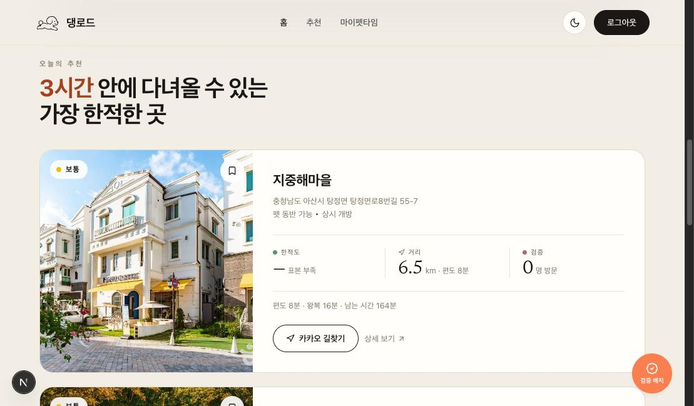 | 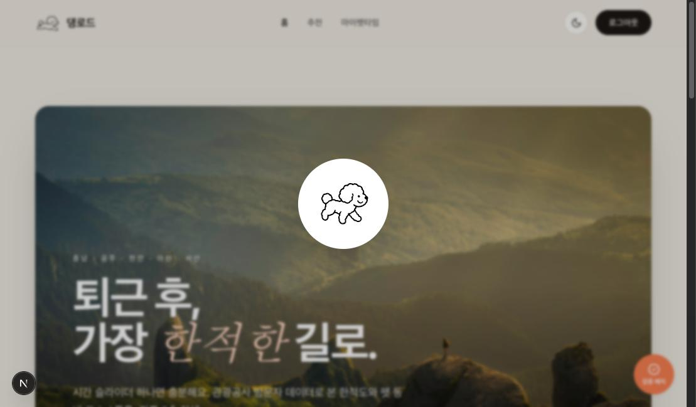 |

<br/>

# ❤️‍🔥 Motivation

반려견과 나가고 싶은 마음은 매일 있지만, 퇴근 후 남은 시간은 늘 애매합니다.
"지금 출발하면 어디까지 다녀올 수 있지?", "거긴 강아지 데려가도 되나?", "사람 많으면 어쩌지?" —
세 가지 질문을 매번 검색하다 보면 저녁이 끝나 있습니다.

댕로드는 이 셋을 슬라이더 하나로 줄였습니다. 가용 시간을 고르면 이동 반경을 계산하고,
한국관광공사 방문자 데이터로 본 **한적도**, TourAPI 반려동물 동반여행 데이터 기반 **펫 동반 가능 여부**,
실제 방문자의 **검증 배지**까지 한 장의 카드로 답합니다.

<br/>

# 🛠️ Tech Stacks

#### Frontend

&nbsp;

&nbsp;

&nbsp;

&nbsp;


#### Backend

&nbsp;

&nbsp;

&nbsp;
-000000?style=flat-square&logo=deno&logoColor=fff)
&nbsp;


#### Infra & Data

&nbsp;

&nbsp;

&nbsp;

&nbsp;


<br/>

# 🎯 Feature

## 인트로 영상 스플래시

사이트에 처음 들어오거나 홈을 새로고침하면 직접 제작한 스톱모션 인트로 영상이 재생됩니다.
GNB 이동·로그인 복귀·뒤로가기에는 다시 나오지 않고(Navigation Timing으로 진입 유형 판별),
'오늘 하루 보지 않기'와 '건너뛰기'를 제공합니다. 소리 있는 자동재생이 차단된 브라우저에서는
플레이 버튼 한 번으로 소리와 함께 시작합니다.


## 홈 · 검색 콘솔

에디토리얼 무드의 히어로 아래, 시간 슬라이더(1~6시간) · 출발지(충남 4시 + 현 위치) ·
반려견 선택 · 출발 시각으로 구성된 검색 콘솔이 있습니다. 슬라이더를 움직이면
"반경 약 N km 안에서 찾고 있어요" 캡션이 실시간으로 따라옵니다.

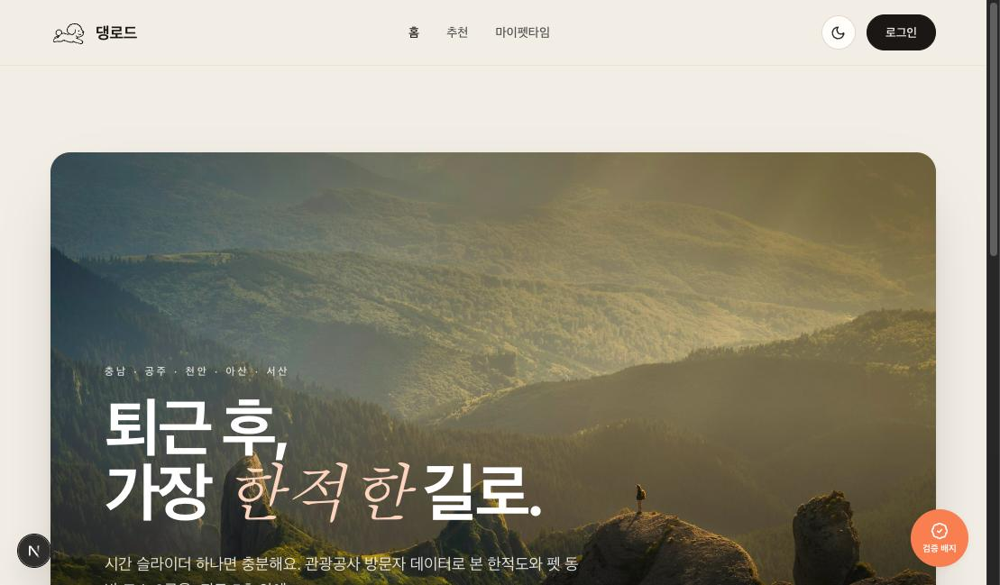
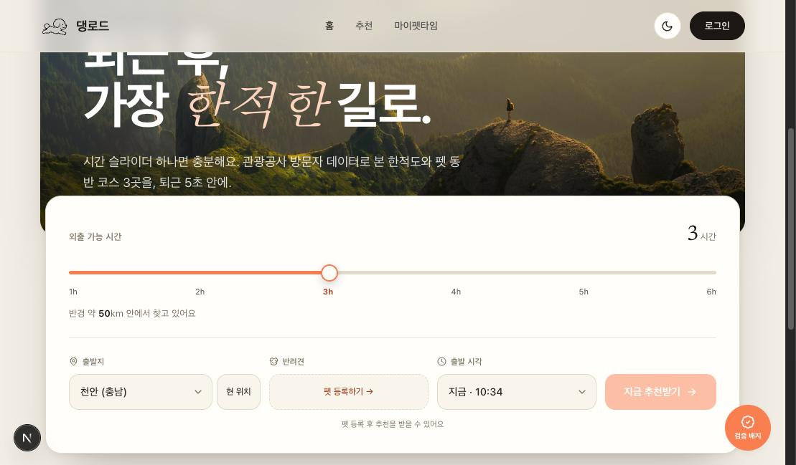

## 추천 결과

시간 예산(왕복 이동시간) 안에 들어오는 장소를 점수순으로 보여주는 매거진 카드입니다.
한 장의 카드에 **한적도 상태 뱃지(한적/보통/복잡 — 신호등 색)** · 주소와 운영시간 ·
한적도/거리/검증 스탯 · 편도·왕복·남는 시간 분해 · 카카오 길찾기 · 북마크가 담깁니다.


### 비숑 로딩 스피너

추천 계산·페이지 이동 등 API를 기다리는 동안, 직접 제작한 8프레임 달리기 사이클의
비숑이 화면 정중앙에서 달립니다. 인라인 SVG 패스 기반이라 외부 에셋 의존성이 없습니다.


### 페이지네이션

첫 검색은 PRD 기본값인 3곳만 보여주고, 서버 offset 페이지네이션으로 10곳씩 이어 받습니다.
점선 `…` 버튼은 "아직 안 받아온 페이지가 남아 있다"는 표시로, 누르면 실제 페이지 번호로
바뀝니다. 페이지를 오가도 순위가 흔들리지 않도록 후보 집합과 검색 시각을 고정합니다.

| 1페이지 (3곳 + 미로드 표시 `…`) | 2페이지 로드 후 |
|:--:|:--:|
| 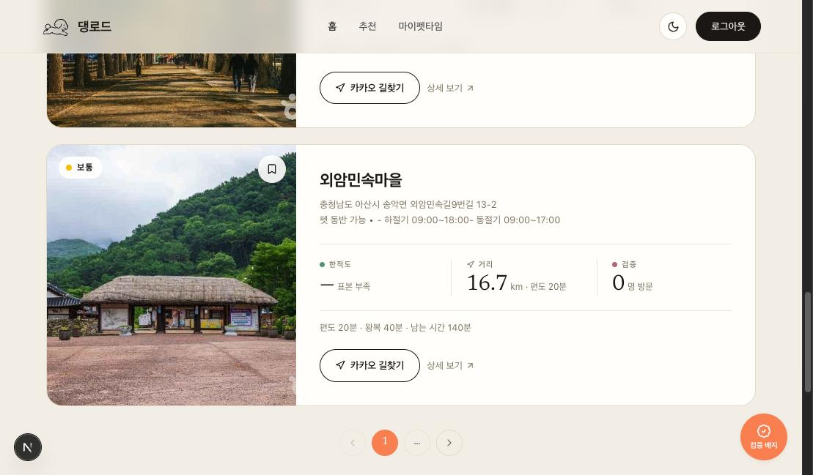 | 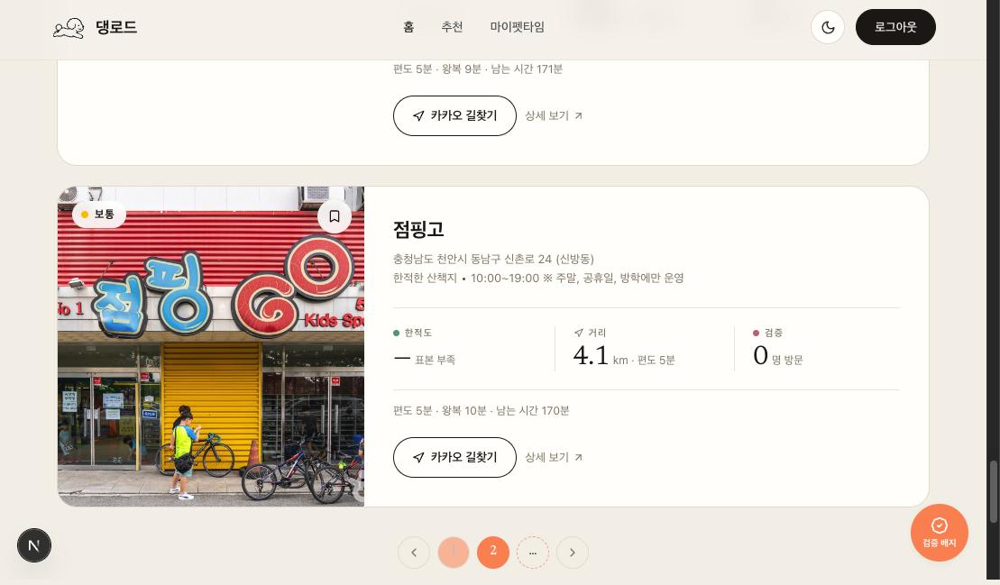 |

## 장소 상세 · 후기 작성

사진 · 펫 정책 원문 · 시간대별 한적도 · 검증 진행도(3명 기준)와 함께,
별점 + 텍스트 + 사진(최대 8장)을 올리는 후기 폼이 있습니다. 하단에는 홈 검색의 출발지를
기억해 출발→도착으로 여는 카카오 길찾기와 북마크 토글이 있습니다.

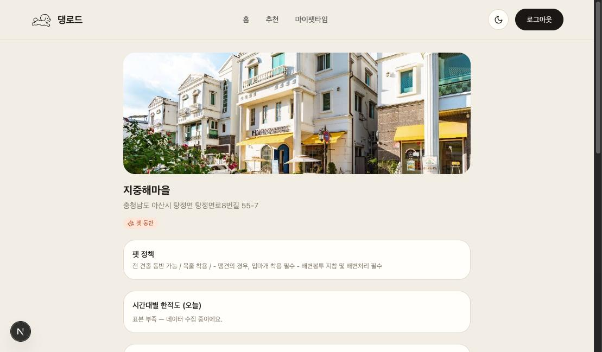
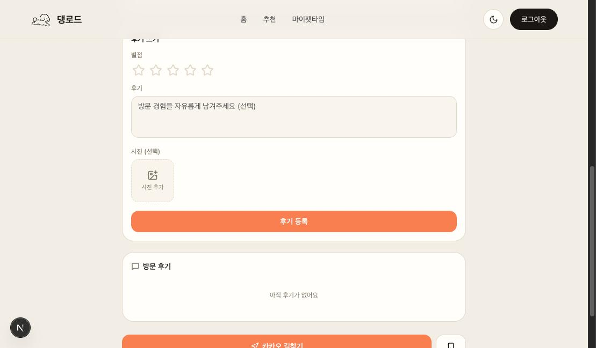
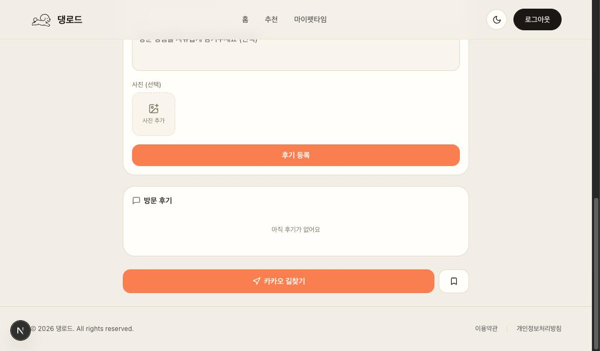

## 소셜 로그인 · 서비스 동의

카카오·구글 소셜 계정으로 가입합니다. 로그인 후 필수 동의(이용약관·개인정보)가 없거나
**약관이 개정되면** 전면 동의 게이트가 다시 떠서 최신 버전 동의를 받습니다.
동의 이력은 종류·버전·시각과 함께 적재됩니다. 위치 정보는 '현 위치' 사용 시점에 별도로 동의받습니다.

| 로그인 | 비로그인 게이트 |
|:--:|:--:|
| 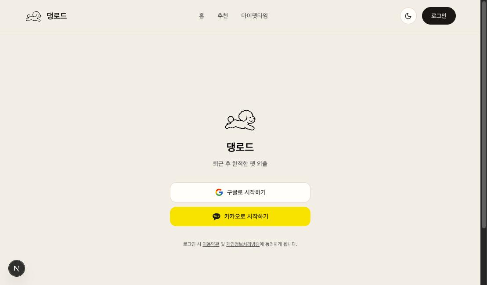 | 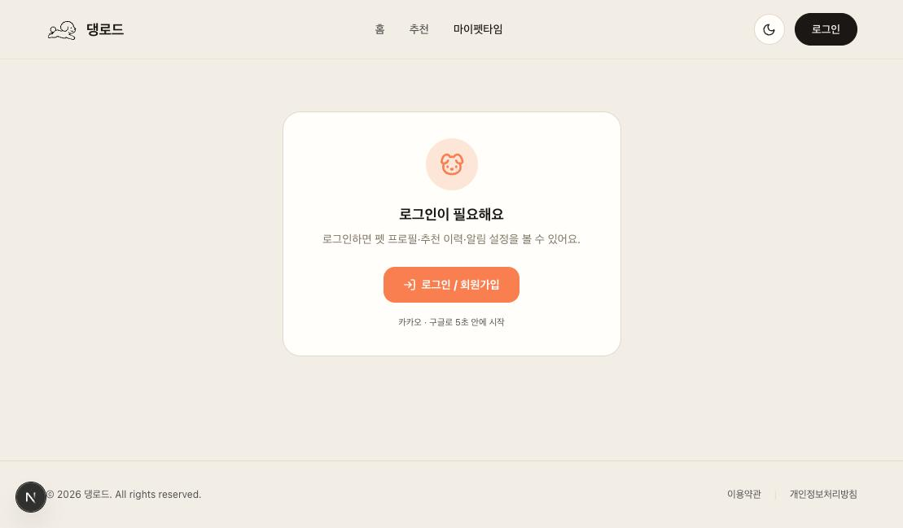 |

## 마이펫타임

프로필 · 방문/후기/검증 스탯 · 반려견 관리(민감 건강정보는 별도 동의 후 분리 보관) ·
메뉴(알림 설정/추천 이력/내가 쓴 후기/저장한 장소)와 하단의 약관·방침·회원탈퇴 링크로 구성됩니다.

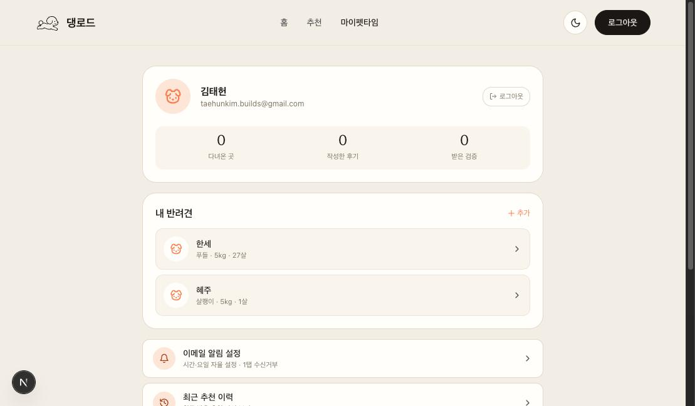
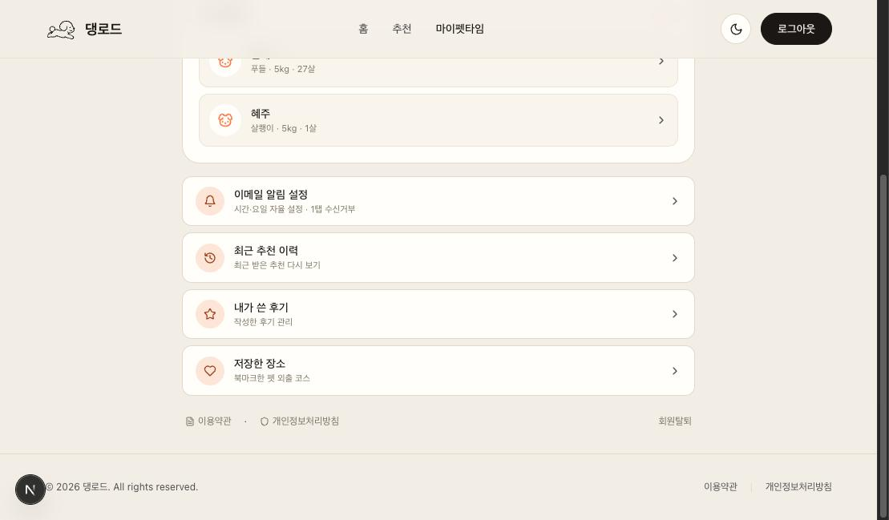

### 추천 이력

받았던 추천을 검색 조건(시간·시각)과 함께 다시 봅니다. 결과 POI를 누르면 상세로 이동합니다.

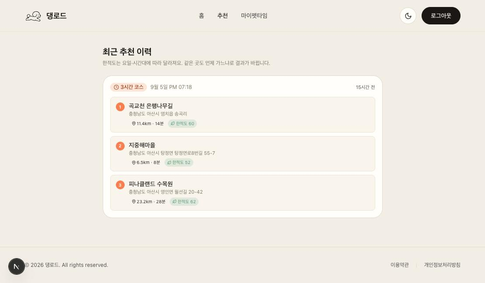

### 내가 쓴 후기 · 저장한 장소

작성한 후기를 확인·삭제하고(신고 누적 숨김 등 상태 표시), 북마크한 장소를 모아 봅니다.

| 내가 쓴 후기 | 저장한 장소 |
|:--:|:--:|
| 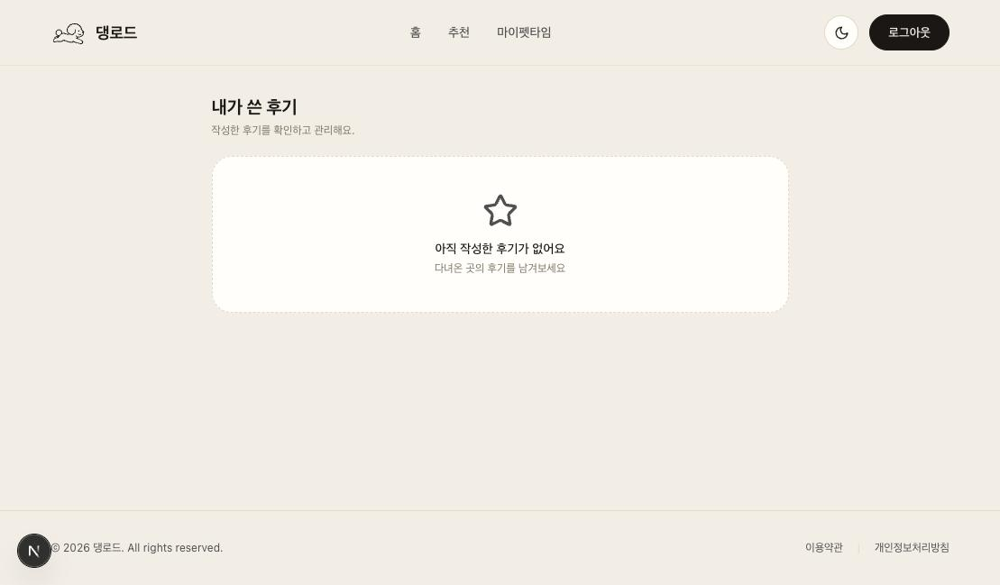 | 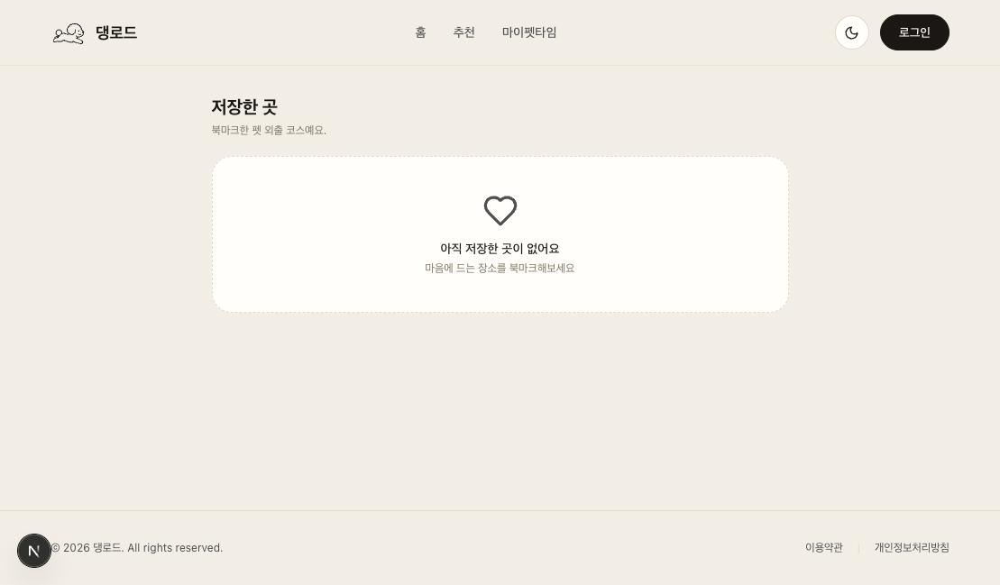 |

### 이메일 알림 설정

발송 시각과 요일을 자율 설정하는 추천 메일 구독입니다. 수신 여부를 바꾸면
마케팅 수신 동의 이력이 함께 기록되고, 메일에는 1탭 수신거부가 들어갑니다.

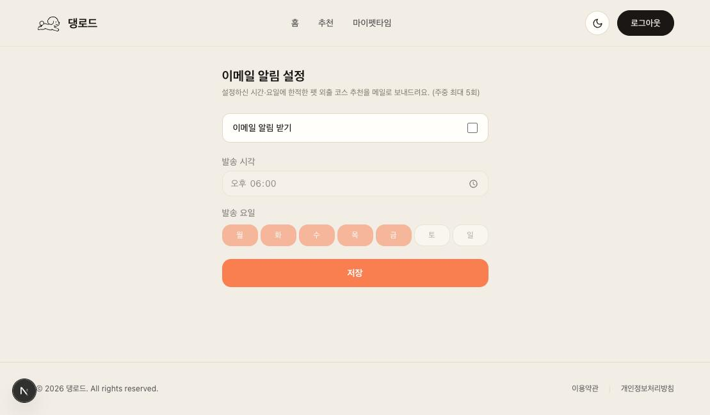

### 회원 탈퇴

확인 문구를 입력해야 진행되는 전용 탈퇴 페이지입니다. 신원 정보와 개인 데이터는 즉시
삭제되고, 공개 후기는 작성자를 알 수 없는 익명 게시물로 남습니다(탈퇴 전 직접 삭제 가능).

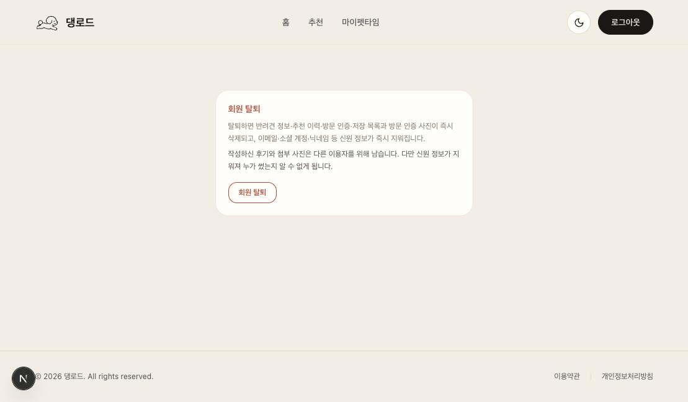

## 이메일 구독 밴드 (개발 준비 중)

홈 하단의 구독 밴드는 발송 인프라가 준비될 때까지 블러 + '개발 준비 중이에요' 배지로
잠겨 있습니다. 플래그 한 줄로 오픈합니다. 아래엔 전 페이지 공통 푸터(저작권·약관·방침)가 있습니다.

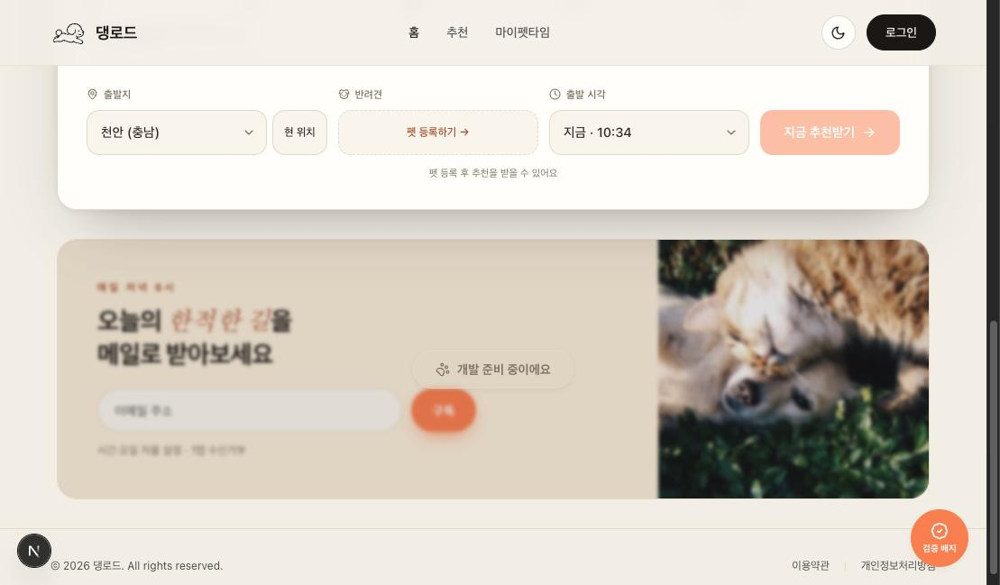

## 이용약관 · 개인정보처리방침

실제 구현된 기능·데이터 처리(탈퇴 파기 정책, 방문 인증 사진의 위치 정보, 위탁처 등)를
일반 사용자 언어로 고지합니다. 버전이 올라가면 기존 회원에게 재동의를 요청합니다.

| 이용약관 v1.2 | 개인정보처리방침 v1.2 |
|:--:|:--:|
| 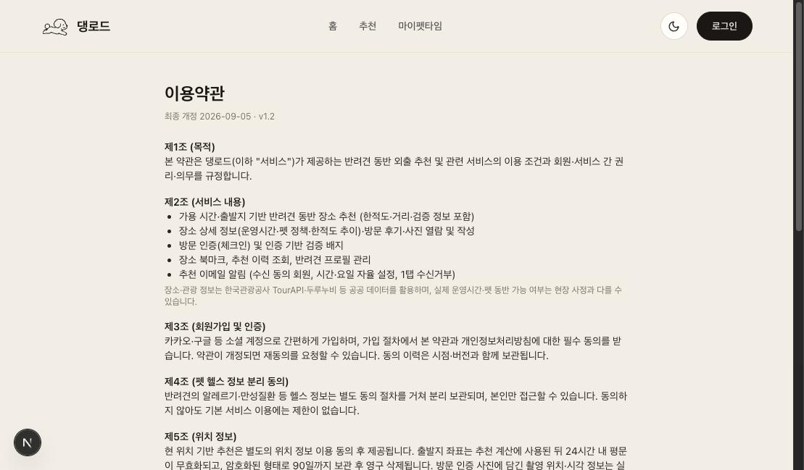 | 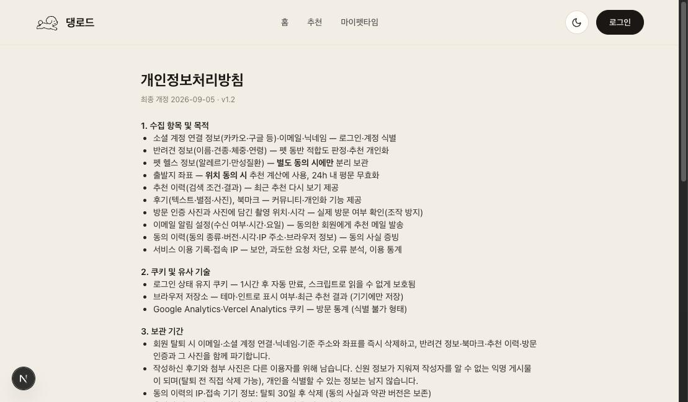 |

<br/>

# 🖥️ Development

### 1. "한적도"는 어떻게 계산할까?

한국관광 데이터랩의 방문자 집중률 데이터를 시군구·요일 단위로 적재하고, 요청 시각과 가장
가까운 시간대를 매칭해 점수화합니다. 요일·지역은 실측, 시간대는 추정이라는 근거를 카드에
그대로 밝히고, 합성 기준선과 실측 데이터를 DB 레벨에서 소스 값으로 구분해 관리합니다.

### 2. 페이지를 넘겨도 추천 순위가 흔들리지 않으려면?

처음엔 요청마다 후보 수를 (offset+limit)에 비례해 잡았더니 페이지 간 중복·누락이 생겼습니다.
거리 점수의 분모(최대 거리)가 후보 집합에 의존해, 같은 검색인데 offset만 바꿔도 점수가
재계산됐기 때문입니다. 후보 집합 크기를 고정하고 클라이언트가 첫 검색의 `startAt`을 재사용해
모든 페이지가 같은 집합·같은 기준에서 잘려 나오게 했습니다.

### 3. Edge Function에서는 Prisma를 못 쓴다

추천 계산은 Supabase Edge Functions(Deno)에서 돌지만 Prisma는 콜드스타트·번들 문제로 쓸 수
없습니다. 그래서 Server Actions(Next.js)는 Prisma + pg adapter, Edge는 supabase-js 배치 쿼리로
역할을 나눴습니다. POI별 개별 쿼리(~120개/요청)를 `.in()` 배치 3개로 줄여 웜 응답을
1.8s → 0.5s로 만들었습니다.

### 4. 검증 배지는 누가 붙이나 — 앱이 아니라 DB 트리거

방문 인증이 INSERT될 때마다 Postgres 트리거가 "최근 6개월, 사진 있는 유효 인증, 서로 다른
사용자 3명 이상"을 검사해 배지를 자동 부여합니다. 배지에는 6개월 만료가 찍혀 pg_cron이
회수합니다. 인증 사진의 EXIF 좌표·촬영 시각을 서버에서 대조해 조작(어뷰징)을 걸러냅니다.

### 5. 탈퇴하면 공개 후기는 어떻게 되나

계정 행을 지우면 FK CASCADE로 다른 이용자가 읽던 후기까지 소급 삭제되는 문제가 있었습니다.
대신 탈퇴 시 식별 정보(이메일·소셜 ID·닉네임·좌표)를 즉시 비우고 개인 데이터를 지운 뒤,
후기는 재식별이 불가능한 익명 행으로 남깁니다. 동의 이력의 IP·기기 정보만 30일 뒤 지워
증빙 가치와 파기 의무를 함께 지킵니다. 이 동작은 약관·방침 문구와 1:1로 일치시켰습니다.

### 6. 소리 있는 인트로 자동재생은 브라우저가 막는다

모든 브라우저가 소리 있는 자동재생을 차단하므로, 먼저 소리 켠 재생을 시도하고 거부되면
플레이 버튼을 띄워 클릭(사용자 제스처) 한 번으로 소리와 함께 시작합니다. 또 문서 진입
유형(navigate/reload/back_forward)과 세션 플래그를 조합해 "처음 들어왔을 때와 새로고침에만"
재생되도록 했습니다.

### 7. 로딩 비숑은 GIF가 아니다

8프레임 달리기 사이클을 인라인 SVG 패스로 내장한 React 컴포넌트입니다. GIF와 달리 투명
배경이 깨지지 않고, 크기·속도·색(currentColor)을 코드로 제어하며, requestAnimationFrame으로
프레임을 돌려 어떤 배율에서도 선명합니다. 아트워크의 viewBox 치우침은 전 프레임 바운딩
박스를 계산해 보정했습니다.

<br/>

# ⚙️ Getting Started

```bash
# 1. 의존성 (Node 20.19+ / 22.12+ — .nvmrc 참고)
npm install

# 2. 환경 변수
cp apps/web/.env.example apps/web/.env.local
cp apps/api/.env.example apps/api/.env
# DATABASE_URL, AUTH_SECRET, AUTH_KAKAO_*/AUTH_GOOGLE_*, KAKAO_REST_API_KEY,
# UPSTASH_REDIS_REST_*, TOUR_API_SERVICE_KEY 등을 채웁니다

# 3. DB 마이그레이션 + 클라이언트
cd apps/api && npx prisma migrate deploy && npx prisma generate

# 4. 개발 서버
npm run dev:web              # http://localhost:3000
cd apps/api && npx supabase start   # (선택) 로컬 Supabase
```

```
.
├── apps/
│   ├── web/                Next.js 15 (App Router) + Auth.js v5 + Prisma
│   └── api/                Prisma 스키마(19 마이그레이션) + Supabase Edge Functions
├── changelog/              프론트·백엔드 작업 기록 (브랜치 단위)
├── docs/screenshots/       README 스크린샷
└── 댕로드_PRD_v1.md        제품 요구사항 정의서
```

<br/>

# 📆 Schedule

- 1차 베타 지역: 충남 4시 (공주 · 천안 · 아산 · 서산)
- 베타(2026.08~10): 실데이터 전환 · 추천 페이지네이션 · 동의/탈퇴 정비 완료, 이메일 발송 준비 중
- 이후: 한적도 실측 시간대 데이터 확장, 방문 인증 화면, 타 지역 확장
