# 댕로드 (DaengRoad) — 기능설명서

> 2026 관광데이터 활용 공모전 · ① 웹·앱 개발 부문
> 팀 **After-Daeng-Road** · 작성일 2026-09-14 · 공모전 기능설명서 양식(PPTX)과 같은 내용을 Markdown 으로 정리한 문서

| 항목 | 내용 |
|---|---|
| 팀명 | After-Daeng-Road |
| 서비스명 | 댕로드 (DaengRoad) |
| 메인 카피 | 퇴근 후, 가장 한적한 길로. |
| 운영 URL | https://after-daeng-road-web-pi.vercel.app |

---

## 1. 서비스 소개

### 1.1 서비스명 · 유형 · 개요

| 항목 | 내용 |
|---|---|
| 서비스명 | 댕로드 (DaengRoad) |
| 서비스 유형 | **웹 서비스** (반응형 웹 · PC/모바일 브라우저 공통, 별도 설치 없음) |
| 서비스 개요 | 퇴근 후 남은 시간을 슬라이더로 고르면, 한국관광공사 방문자 데이터 기반 **"한적도"** 와 **반려동물 동반 가능 여부**를 따져 충남 근교에서 지금 다녀올 수 있는 펫 외출지를 5초 안에 추천하는 웹 서비스 |

### 1.2 주제 선정 이유

1. **시장 변곡점** — 2026.3.1 「반려동물 동반 출입 음식점」 제도 시행, 반려 가구 600만 진입. 평일 퇴근 후 반려견과 나가는 "일상형 외출" 수요는 급증했지만 여기에 특화된 서비스가 없음.
2. **반복되는 세 가지 질문** — "지금 출발하면 어디까지?", "거긴 강아지 데려가도 되나?", "사람 많으면 어쩌지?" 를 매번 검색하다 저녁이 끝남. 펫 정보는 블로그·SNS에 흩어져 있고, 「펫 동반 가능」 표기가 현장(테라스만 허용)과 달라 헛걸음이 잦음.
3. **관광공사 데이터로 풀 수 있는 문제** — 국문 관광정보 · 반려동물 동반여행 · 데이터랩 방문자 · 두루누비 데이터를 결합하면 "시간 → 반경 → 펫 가능 → 한적한 곳" 추천을 실제로 계산할 수 있음. 반려동물 도메인에 이를 적용한 사례가 없음.
4. **충남 특화** — 반려동물 동반관광 활성화 조례(2026.1 도의회 상임위 통과), 태안 「반려동물 친화관광도시」 선정 등 정책이 가장 빠르게 제도화되는 지역이라 초기 시장으로 최적.

### 1.3 서비스 핵심기능

| # | 기능 | 내용 |
|---|---|---|
| 1 | **시간 슬라이더 추천** | 외출 가능 시간(1~6h) · 출발지(충남 15시군 드롭다운/현 위치) · 반려견 · 출발 시각 → 반경 자동 계산 → 펫 동반 가능하고 한적한 곳 3곳을 카드로 추천 (거리 · 편도/왕복 · 남은 시간) |
| 2 | **한적도 점수 (0~100)** | 한국관광 데이터랩 시군구 방문자 데이터(외지인 비율) 실측 + 시간대 가중 → 카드·상세에 점수와 근거 문구 표시. 집중률 30일 예측 API 연동 시 "내일 같은 시간 · 이번 주 평균" 라인 자동 표시 |
| 3 | **펫동반 검증 배지** | 관광공사 반려동물 동반여행 데이터(1차) + 사용자 방문 인증(사진 EXIF 촬영 좌표 1km 이내 · 촬영일 7일 이내 · 서로 다른 3명 · 최근 6개월) 교차 검증 → DB 트리거가 배지 자동 부여·만료 |
| 4 | **두루누비 산책로** | 충남 걷기여행길 16코스(서해랑길 등) 목록 · 거리/소요/난이도 · 경로 좌표를 이어 그린 미리보기(카카오맵 또는 SVG 스케치) · 카카오 길찾기 연결 |
| 5 | **장소 상세 · 후기** | 펫 정책(체구·목줄·실내/테라스) · 시간대별 한적도 · 검증 진행도(0/3명) · 방문 인증 · 후기(별점·사진) · 북마크 · 카카오 길찾기 |
| 6 | **마이펫타임** | 반려견 등록(품종·체중·나이) · 추천 이력 · 내가 쓴 후기 · 저장한 장소 · 이메일 알림 설정(시간·요일, 1탭 수신거부) · 회원 탈퇴 |
| 7 | **퇴근 후 추천 이메일** | 설정한 시간·요일에 pg_cron → Edge 함수가 개인별 추천을 만들어 발송, HMAC 토큰 수신거부 링크 (발송 키 등록 후 활성화) |
| 8 | **소셜 로그인 · 동의** | 구글 · 카카오 로그인, 이용약관/개인정보/이메일 수신 동의 이력 저장, 위치 정보는 좌표 단위로만 사용(주소 미저장) |

### 1.4 서비스 이미지

**대표 이미지**

**상세 이미지**

| ① 홈 — 시간 슬라이더 · 출발지 · 반려견 · 출발 시각 | ② 추천 카드 — 한적도 · 거리/편도 · 검증 |
|:--:|:--:|
| 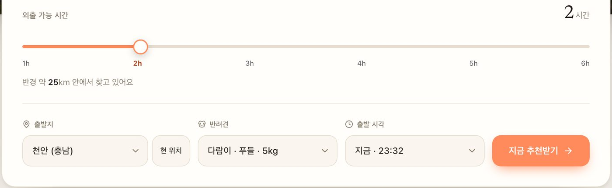 | 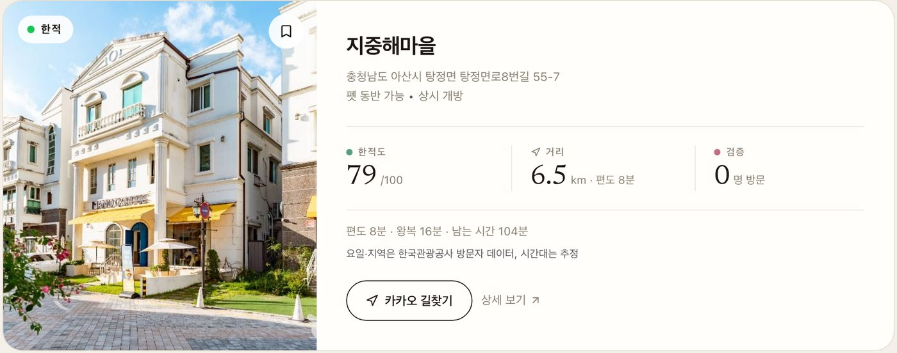 |

| ③ 장소 상세 — 방문 인증(검증 배지) | ④ 두루누비 산책로 — 경로 미리보기 |
|:--:|:--:|
| 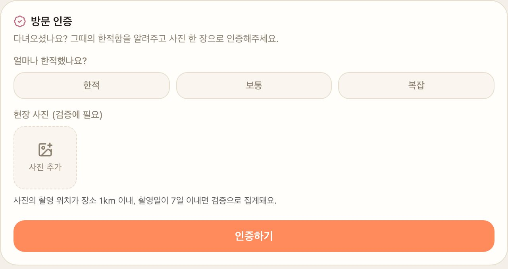 | 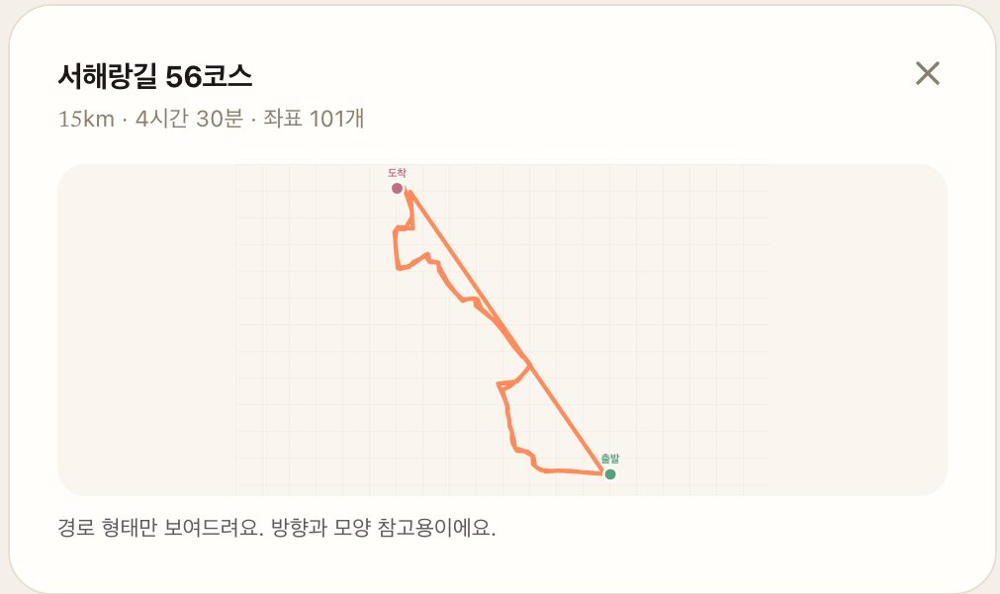 |

---

## 2. 지역 특화 서비스 구현 세부내용

**특화 지역: 충청남도** — 1차 서비스 지역 공주 · 천안 · 아산 · 서산 (출발지는 충남 15개 시·군 전체 선택 가능)

- **데이터** — 국문 관광정보(areaCode 33) 충남 POI 966건 + 반려동물 동반여행 83건을 적재하고, 천안은 동남구·서북구를 나눠 수집. 데이터랩 시군구(33020 · 33040 · 33050 · 33150 …) 방문자 데이터로 요일별 한적도 140행 실측.
- **출발지** — 충남 15개 시·군(천안·공주·아산·서산·보령·논산·계룡·당진·금산·부여·서천·청양·홍성·예산·태안) 드롭다운 + 현 위치. 시군구 코드를 관광공사 코드(33xxx)·행정코드(44xxx) 양쪽으로 매핑.
- **산책로** — 두루누비 충남 걷기여행길 16코스(서해랑길 56~ 등)를 시·군 라벨과 함께 제공, 경로 좌표를 이어 미리보기.
- **추천 반경** — 충남 도내 이동을 전제로 시간→반경(1h≈15km … 6h≈70km)을 설계해 퇴근 후 왕복이 가능한 근교만 추천.
- **정책 연계** — 충남 반려동물 동반관광 활성화 조례 · 태안 반려동물 친화관광도시 등 지역 정책과 맞물린 초기 시장. 후기·방문 인증 데이터로 충남 펫 동반 장소 검증 데이터가 쌓이는 구조.

---

## 3. 서비스 핵심 기능별 흐름도

### 핵심 기능 1 — 시간 슬라이더 추천

외출 가능 시간 · 출발지 · 반려견 · 출발 시각을 입력하면 반경을 자동 계산하고, 펫 동반 가능하면서 한적한 곳 3곳을 카드로 추천하는 기능입니다.

| 단계 | 화면 | 설명 |
|:--:|:--:|---|
| 1 |  | 홈 콘솔에서 외출 가능 시간(1~6h)을 슬라이더로 고르고 출발지(충남 시·군 또는 현 위치)·반려견·출발 시각을 선택한 뒤 **[지금 추천받기]** 를 누른다. |
| 2 | 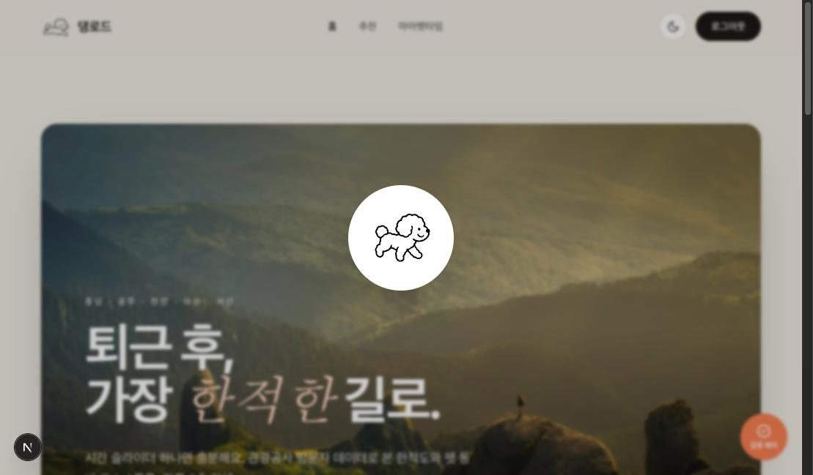 | Edge 함수가 시간→반경을 계산하고, 반경 내 펫 동반 가능 장소를 골라 한적도·ETA·운영시간을 점수화한다 (응답 대기 중 로딩 표시). |
| 3 |  | 추천 카드 3장에 한적도(0~100), 거리·편도 시간, 검증 수, 왕복 후 남은 시간과 데이터 근거 문구가 표시된다. |
| 4 | 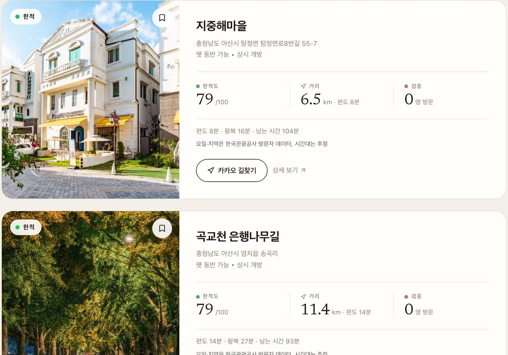 | **[카카오 길찾기]** 로 바로 출발하거나 **[상세 보기]** 로 펫 정책·한적도·검증 진행도를 확인한다. 추천 결과는 이력으로 저장된다. |

### 핵심 기능 2 — 한적도 점수 (현재 + 30일 예측)

한국관광 데이터랩 방문자 데이터로 시군구·요일별 한적도를 실측해 0~100 점으로 보여주고, 집중률 예측 API로 30일 예측 라인을 붙이는 기능입니다.

| 단계 | 화면 | 설명 |
|:--:|:--:|---|
| 1 |  | 추천 카드의 한적도 칸에 점수와 등급(한적·보통·복잡)이 표시된다. 점수는 데이터랩 외지인 방문 비율을 반전한 값이다. |
| 2 |  | 카드 하단에 "요일·지역은 한국관광공사 방문자 데이터, 시간대는 추정" 근거 문구를 의무 표시해 추천 이유를 투명하게 보여준다. |
| 3 | 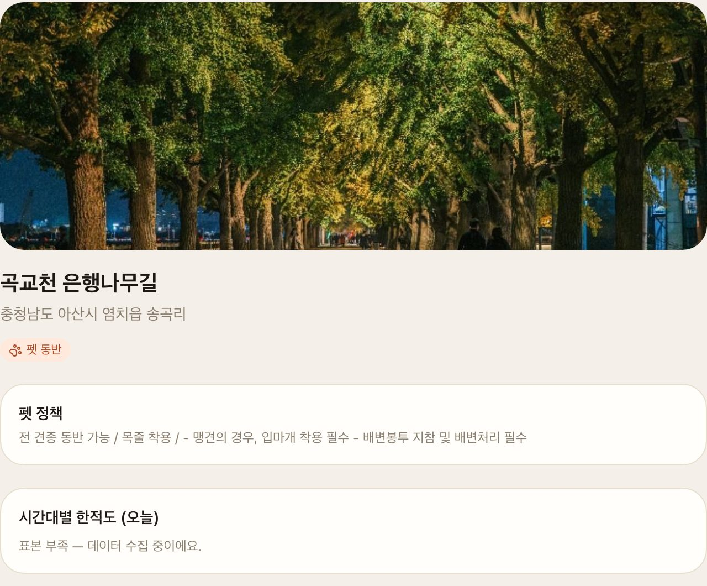 | 장소 상세에서 시간대별 한적도(오늘)를 확인한다. 표본이 부족한 시간대는 숨기지 않고 "데이터 수집 중"으로 표시한다. |
| 4 | 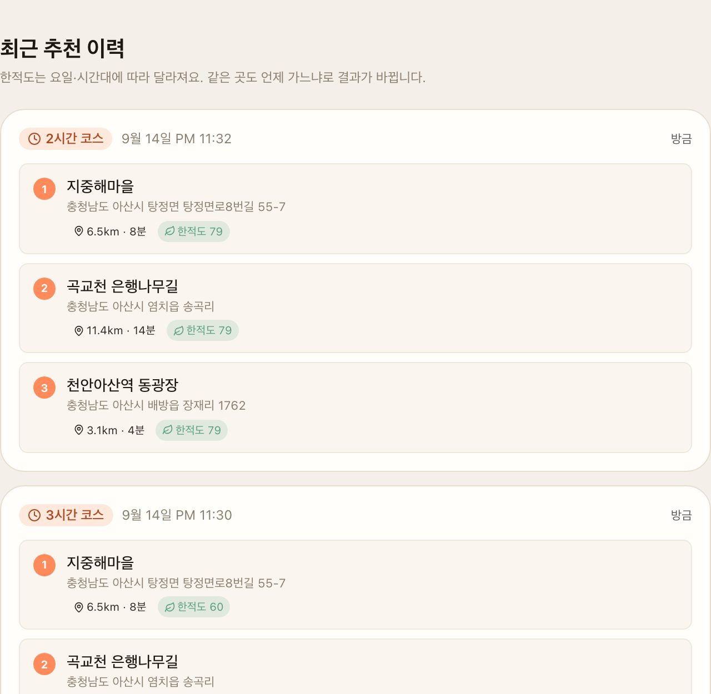 | 집중률 30일 예측 API(활용신청 진행 중) 적재 후 카드에 "내일 같은 시간 · 이번 주 평균" 예측 라인이 자동 표시된다. 추천 이력에서 과거 추천을 다시 본다. |

### 핵심 기능 3 — 펫동반 검증 배지

관광공사 반려동물 데이터에 더해 실제 방문자 3명의 사진 인증이 쌓이면 장소에 검증 배지를 자동으로 붙여 헛걸음을 막는 기능입니다.

| 단계 | 화면 | 설명 |
|:--:|:--:|---|
| 1 | 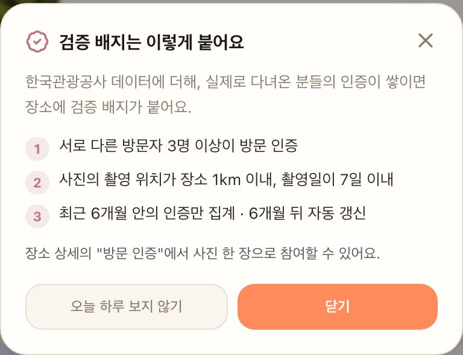 | 홈 우측 하단 **[검증 배지]** 버튼을 누르면 배지 규칙(서로 다른 3명 · 사진 촬영 위치 1km/7일 · 최근 6개월)을 안내한다. |
| 2 |  | 장소 상세의 **[방문 인증]** 에서 한적/보통/복잡을 고르고 현장 사진 1장을 올린다. 브라우저가 사진 EXIF 촬영 좌표·시각을 읽어 함께 전송한다. |
| 3 | 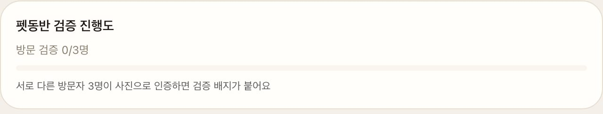 | 서버가 장소 1km 이내 · 7일 이내 조건을 판정해 검증으로 집계하고, 상세의 "펫동반 검증 진행도(0/3명)"가 올라간다. |
| 4 |  | 서로 다른 3명이 검증되면 DB 트리거가 `PET_VERIFIED` 배지를 부여하고, 카드·상세에 배지 칩이 붙는다. 6개월 뒤 크론이 자동 만료한다. |

### 핵심 기능 4 — 두루누비 산책로

한국관광공사 두루누비의 충남 걷기여행길 코스를 반려견 산책로로 제공하고, 경로 좌표를 이어 미리보기와 카카오 길찾기를 연결하는 기능입니다.

| 단계 | 화면 | 설명 |
|:--:|:--:|---|
| 1 | 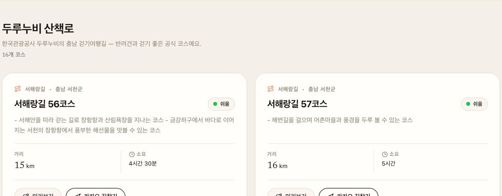 | GNB **[산책로]** 에서 충남 16코스 목록을 본다. 코스명·시군·난이도·거리·소요 시간이 카드로 정리되어 있다. |
| 2 |  | **[미리보기]** 를 누르면 카드 자리에서 두루누비 경로 좌표를 이어 그린 경로(출발·도착 표시)를 본다. 카카오 JS 키가 있으면 지도 위에 그려진다. |
| 3 |  | **[카카오 길찾기]** 를 누르면 코스 출발점까지 카카오맵 길찾기가 새 창으로 열린다. |

### 핵심 기능 5 — 마이펫타임 · 추천 이메일

소셜 로그인 후 반려견을 등록하고, 추천 이력·후기·저장 장소를 관리하며, 원하는 시간·요일에 퇴근 후 추천 이메일을 받는 기능입니다.

| 단계 | 화면 | 설명 |
|:--:|:--:|---|
| 1 |  | 구글 또는 카카오 계정으로 로그인한다. 별도 회원가입 없이 SNS 연동으로 시작한다. |
| 2 | 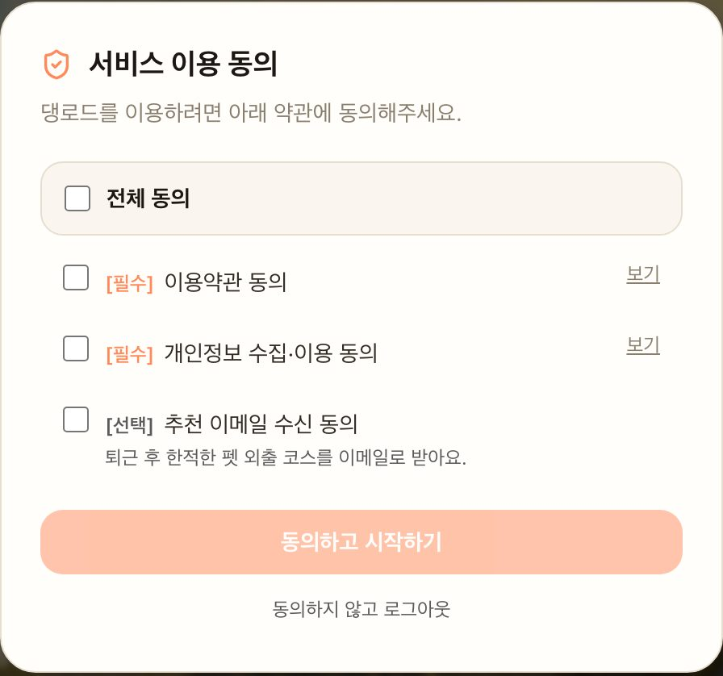 | 최초 로그인 시 이용약관·개인정보 수집(필수), 추천 이메일 수신(선택) 동의를 받고 이력을 저장한다. |
| 3 | 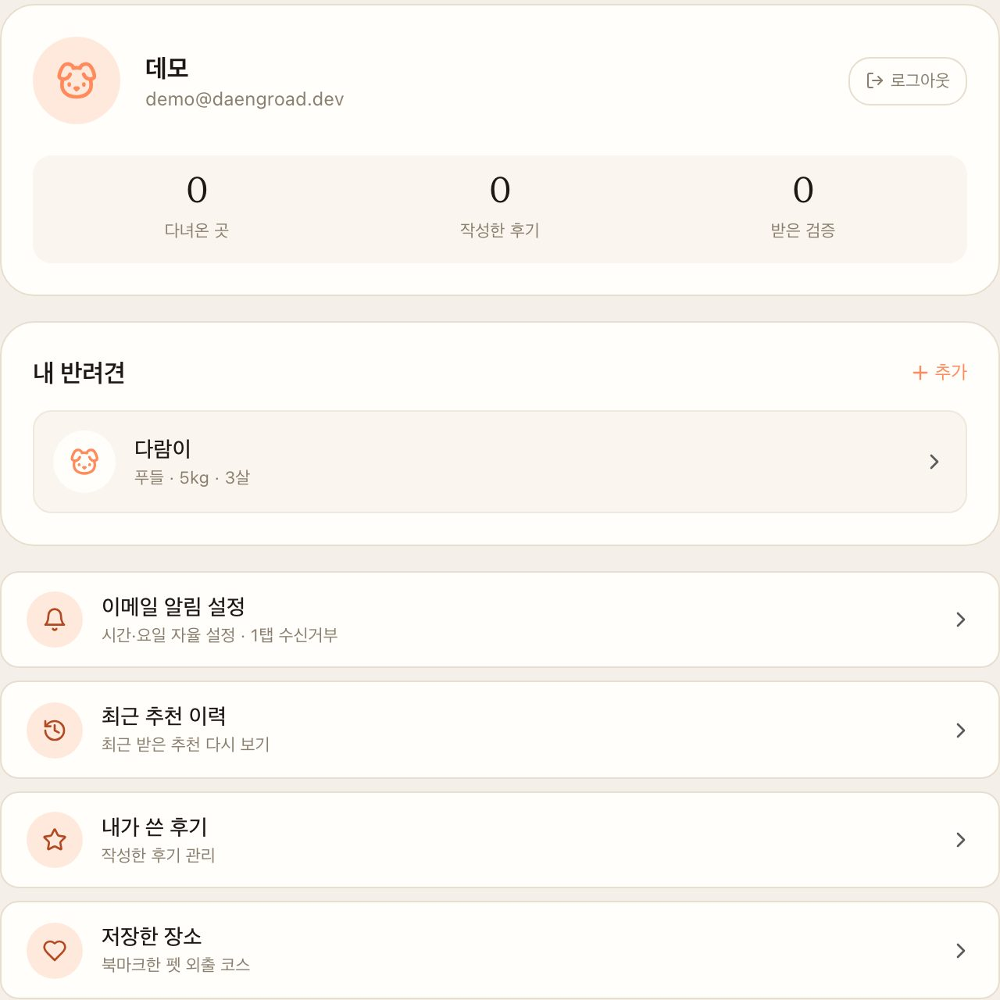 | 마이펫타임에서 반려견을 등록하고 다녀온 곳·후기·검증 수, 추천 이력·내 후기·저장한 장소를 관리한다. |
| 4 | 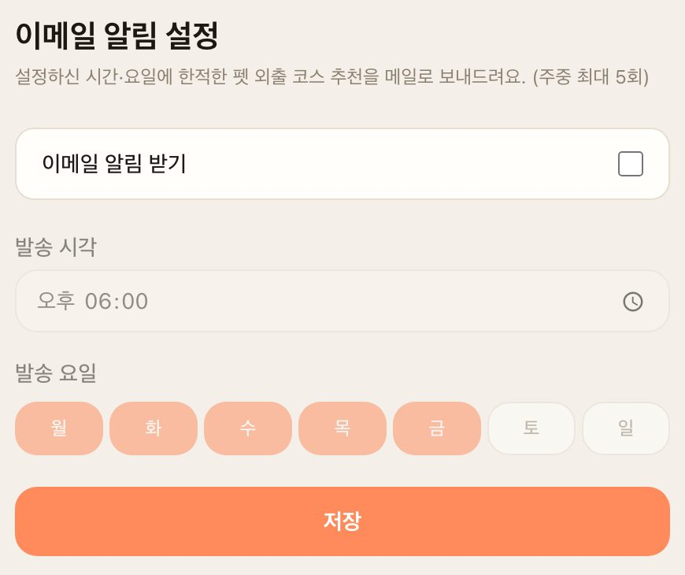 | 이메일 알림 설정에서 발송 시각·요일을 고르면 pg_cron → Edge 함수가 그 시각에 개인별 추천을 만들어 메일로 보낸다 (1탭 수신거부). |

---

## 4. 데이터 활용 — 한국관광공사 OpenAPI

| # | API명 | 상세설명 | 상태 |
|---|---|---|---|
| 1 | **국문 관광정보 서비스** `KorService2` (areaBasedList2 · detailIntro2 · detailPetTour2) | 충남(areaCode 33) 관광지·문화시설·음식점 등 966건 적재. 명칭·주소·좌표·대표이미지·운영시간을 추천 후보와 장소 상세에 활용 | 운영 중 |
| 2 | **반려동물 동반여행 서비스** `KorPetTourService2` (areaBasedList2 · detailPetTour2) | 펫 동반 가능 장소 83건과 동반 정책(체구 제한·목줄·실내/테라스)을 적재. "펫 동반" 필터, 펫 정책 카드, 검증 배지의 1차 근거로 활용 | 운영 중 |
| 3 | **한국관광 데이터랩 지역별 방문자 서비스** `DataLabService` (locgoRegnVisitrDDList) | 시군구별 일자 방문자 수(현지인·외지인)로 요일별 한적도 140행을 실측 적재. 추천 카드·상세의 한적도 점수(0~100) 산출에 활용 | 운영 중 |
| 4 | **두루누비 정보 서비스** `Durunubi` (courseList · routeList) | 충남 걷기여행길 16코스와 경로 좌표를 적재. 산책로 탭 목록, 경로 미리보기, 카카오 길찾기 연결에 활용 | 운영 중 |
| 5 | **관광지 집중률 예측 서비스** `TatsCnctrRateService` (tatsCnctrRatedList) | 향후 30일 관광지별 집중률로 "내일 같은 시간 · 이번 주 평균" 예측 한적도 표시. 예측 테이블·Edge 조회·카드 UI 구현 완료, 적재 스크립트 연동 예정 | 활용신청 진행 중 |

## 5. 데이터 활용 — 기타 API · 데이터

| # | 데이터명 | 상세설명 |
|---|---|---|
| 1 | **카카오모빌리티 길찾기 API** (자동차 경로) | 출발지→장소 실도로 편도 시간(ETA) 계산. 출발지 geohash × 장소 단위로 24시간 캐시(Upstash)해 호출량 통제, 키 미설정 시 직선거리×1.3 추정으로 폴백 |
| 2 | **카카오맵 JavaScript SDK · 카카오맵 길찾기 링크** | 두루누비 경로를 지도 위 폴리라인으로 표시(미리보기), 추천 카드·산책로의 [카카오 길찾기] 딥링크 |
| 3 | **사용자 생성 데이터(UGC)** — 방문 인증 · 후기 · 북마크 | 방문 인증 사진의 EXIF 촬영 좌표·시각(브라우저에서 추출, 원본 좌표는 저장하지 않음), 한적/보통/복잡 평가, 별점 후기 → 검증 배지 부여와 한적도 보정에 활용 |

---

## 6. 서비스 차별성 & 발전계획

### 차별성

1. **거리가 아니라 "남은 시간"으로 찾는다** — 시간 슬라이더 하나로 반경·ETA·왕복 후 남는 시간까지 계산해 퇴근 후 결정 피로를 없앰.
2. **공공데이터 기반 한적도** — 데이터랩 방문자 데이터를 시군구·요일 단위로 실측해 점수화하고 카드마다 근거를 의무 표시. 집중률 30일 예측을 붙일 DB·UI가 이미 준비됨 (펫 서비스 중 "미래 한적도"는 최초).
3. **펫동반 "검증" 배지** — 관광공사 반려동물 데이터 + 사용자 사진 EXIF 교차 검증으로 「표기는 가능, 현장은 테라스만」 헛걸음 방지. 부여·만료가 DB 트리거·크론으로 자동화.
4. **두루누비 공식 코스를 반려견 산책로로** — 경로 좌표를 그대로 이어 미리보기, 카카오 길찾기 연결로 새 산책 코스 발굴.
5. **충남 1지역 집중** — 반려동물 동반관광 조례·태안 친화관광도시 등 정책 선도 지역을 초기 시장으로, 15개 시·군 출발지 지원.

### 발전계획

| 시기 | 계획 |
|---|---|
| 단기 (~1개월) | Edge 함수 재배포·카카오 키 적용으로 실도로 ETA 전환, 집중률 30일 예측 API 활용신청 완료 후 적재 스크립트 연동 → "미래 한적도" 카드 라인 활성화, 추천 이메일 정식 발송 |
| 중기 (~3개월) | 충남 POI를 4시 중심에서 15개 시·군 전역으로 확대, 수요 강도 지수(지역 관광수요 API) 결합으로 한적도 정밀화, 시간대별 실측 데이터 보강, 추천 이유 칩 클릭 시 데이터 출처 상세 표시 |
| 장기 (6개월~) | 카카오톡 채널 알림, 펫 동반 업체 입점(펫 정책 셀프 등록·사업자 검증)과 예약·쿠폰 수익 모델, 강원·경북 등 타 지역 확장, 계절·날씨 데이터 결합 추천 |
| 데이터 환류 | 사용자 방문 인증·후기를 익명 통계로 정리해 한국관광공사 반려동물 동반여행 데이터 보완에 기여 |
